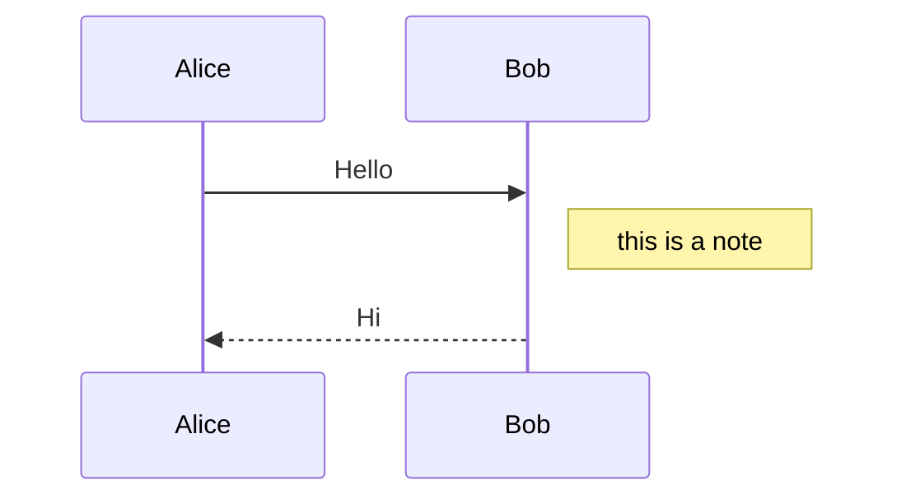

# Welcome to MkDocs

For full documentation visit [mkdocs.org](https://www.mkdocs.org).

## Commands

* `mkdocs new [dir-name]` - Create a new project.
* `mkdocs serve` - Start the live-reloading docs server.
* `mkdocs build` - Build the documentation site.
* `mkdocs -h` - Print help message and exit.

## Project layout

    mkdocs.yml    # The configuration file.
    docs/
        index.md  # The documentation homepage.
        ...       # Other markdown pages, images and other files.

## Code highlight example

```python title="foo.py" linenums="1"
# Python
class Foo(object):
    def __init__(self):
        self.v = 'OK'
```

```java title="Foo.java" linenums="1"
// Java
public class Foo {
    private final String v;
    public Foo() {
        this.v = "OK";
    }
}
```

## Precautionary statement example

!!! Warning
    Example of Warning

## Mermaid diagram example


